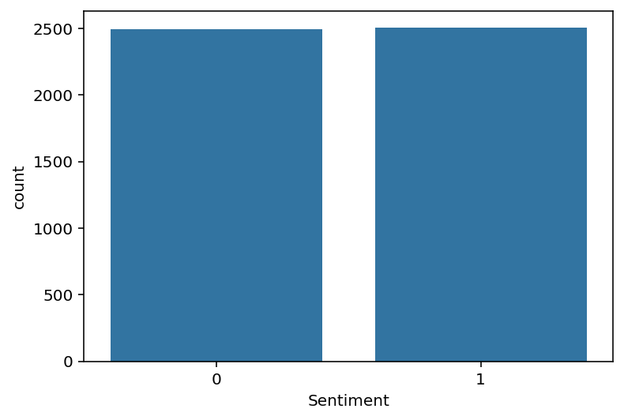
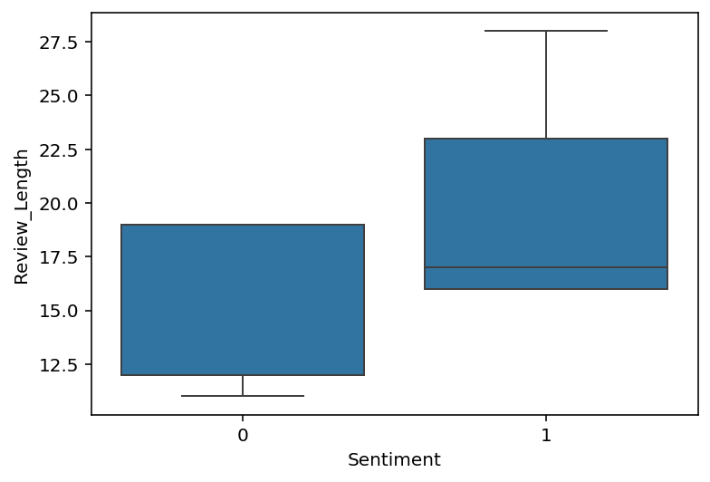
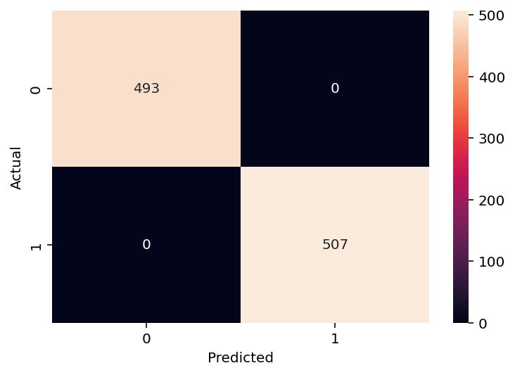

# NLP--Sentiment-Analysis
NLP Sentiment Analysis using Logistic Regression
# NLP Sentiment Analysis Project

## 📌 Project Overview
This project performs **Sentiment Analysis on text reviews** using Natural Language Processing (NLP) and Machine Learning techniques.  
The model classifies reviews into **Positive or Negative sentiments** using TF-IDF Vectorization and Logistic Regression.

---

## ⚙️ Workflow

1. Data Loading & Exploration  
2. Text Preprocessing (cleaning, lowercase, stopwords removal, stemming)  
3. Feature Extraction using TF-IDF  
4. Model Training using Logistic Regression  
5. Model Evaluation  
6. Data Visualization  

---

## 🧠 Model Used
- Logistic Regression (Machine Learning Classifier)

---

## 📊 Visualizations

### 1️⃣ Sentiment Class Distribution
Sentiment Class Distribution

“This graph visualizes the distribution of sentiment categories (0 and 1) in the dataset. It shows that the dataset is perfectly balanced with approximately equal samples in both classes. This balance is important for training a machine learning model as it helps prevent bias toward any one class and ensures the model learns to classify both sentiments with equal accuracy.”

---

### 2️⃣ Sentiment vs Review Length Analysis
Sentiment vs. Review Length Analysis

“This box plot compares the distribution of review lengths across Sentiment 0 and Sentiment 1. It highlights that reviews in Sentiment 1 generally have a wider range and tend to be longer compared to Sentiment 0. The median review length is also higher for Sentiment 1, indicating more detailed user feedback.
This analysis is useful for feature engineering, as review length can provide additional context to improve model performance.
Tech Stack: Python, Seaborn, Matplotlib.”

---

### 3️⃣ Model Performance (Confusion Matrix)

Model Performance: Confusion Matrix

"This matrix shows my model's performance on the test data.
Perfect Prediction: The model correctly classified all samples (493 for Class 0 and 507 for Class 1).
100% Accuracy: Zero False Positives or False Negatives were recorded.
Result: High-precision sentiment classification.
Tech: Python, Scikit-learn, Seaborn."

---

## 🛠️ Tools & Libraries

- Python  
- Pandas  
- NumPy  
- Scikit-learn  
- NLTK  
- Seaborn  
- Matplotlib  

---

## 📈 Model Performance

- The model shows strong performance on the test dataset.  
- Precision, Recall, and F1-score are consistently high for both classes.  
- Logistic Regression with TF-IDF works effectively for sentiment classification.  

⚠️ *Note: Performance may vary on unseen real-world data.*

---

## 🎯 Key Learnings

- NLP text preprocessing pipeline  
- Feature extraction using TF-IDF  
- Machine learning classification  
- Data visualization and insight generation  

---

## 🚀 Conclusion

This project demonstrates sentiment analysis using NLP and Machine Learning, useful for analyzing customer feedback, product reviews, and social media data.
